<!--documentação Técnica do projeto -->
<ESCOPO DO PROJETO>

<Objetivos Principais:>
Desenvolver um sistema para gerenciar máquinas e equipamentos, incluindo suas manutenções e falhas.
Proporcionar uma interface intuitiva que permita fácil cadastro e visualização de informações.
Implementar um sistema de relatórios e indicadores de desempenho para auxiliar na tomada de decisões.
Integrar o sistema com uma API REST para armazenamento e recuperação de dados.
Levantamento de Recursos

<Levantamento de Recursos>

1. <Funcionalidades Principais:>
<Desenvolvimento do Sistema:>
1° - Linguagem: Java
1.1° - Framework Backend: Spring Boot (para construir a API REST).

2. <Gerenciamento de Máquinas e Equipamentos:>
<Banco de Dados:>
1° - Tipo: JSON-Server (para armazenar e recuperar dados).
1.1° - Cálculo de Indicadores:
1.2° - Lógica implementada em Java para calcular MTTR e MTBF.

<Recursos Tecnológicos:>
VsCode: Será utilizada a plataforma VSCode para desenvolver essa aplicação
Banco de Dados: JSON-Server para armazenamento dos dados.
Frameworks: Spring Boot (opcional, se necessário para facilitar a construção da API).
Bibliotecas: Jackson ou Gson para manipulação de JSON.

1. <Riscos Técnicos:>

1° - Integração com a API: Dificuldades na comunicação entre a aplicação Java e o JSON-Server.
1.1° - Solução: Planejar e testar a integração em fases, documentando as chamadas da API.

1.2° - Desempenho: O sistema pode não atender a requisitos de desempenho, especialmente com um grande volume de dados.
1.3° - Solução: Realizar testes de carga e otimizações contínuas durante o desenvolvimento.

2. <Riscos de Requisitos:>
2° - Mudanças nos requisitos: Alterações nas funcionalidades desejadas após o início do desenvolvimento.
2.1° - Solução: Adotar uma abordagem ágil, permitindo revisões periódicas e feedback do cliente.

3. <Riscos de Cronograma:>
3° - Atrasos na entrega: Possíveis imprevistos que podem atrasar o cronograma do projeto.
3.1° - Solução: Estabelecer um cronograma realista com margens de manobra e monitorar continuamente o progresso.

4. <Riscos de Segurança:>
4° - Segurança dos dados: O sistema pode estar vulnerável a ataques ou vazamentos de dados.

5. <Riscos de Usabilidade:>
5° - Interface não intuitiva: Os usuários podem ter dificuldade em usar o sistema.
5.1° - Solução: Realizar testes de usabilidade e coletar feedback de usuários reais antes do lançamento.

DIAGRAMAS DE CLASSE
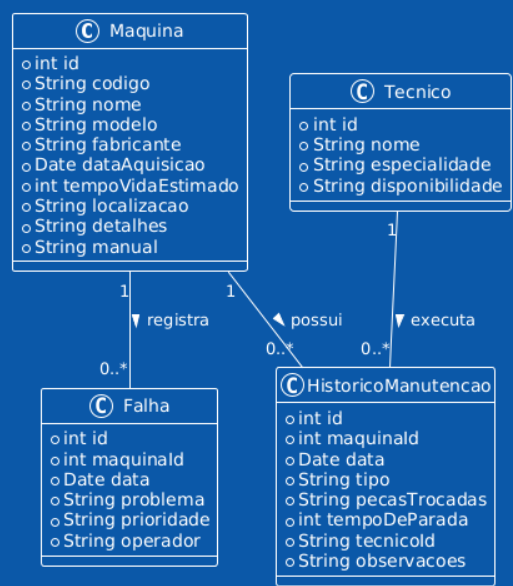

DIAGRAMAS DE FLUXO 
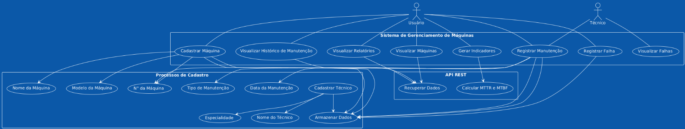

<IMAGENS DOS MÉTODOS GET, POST, PUT, DELETE>

1° Máquinas

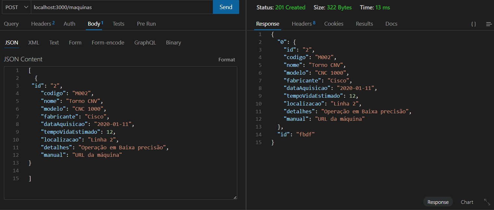
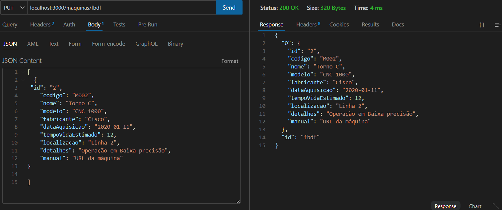
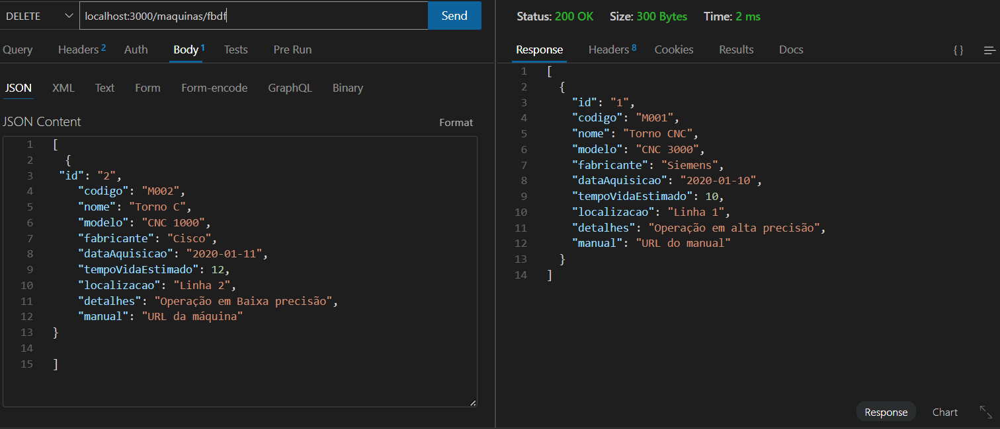

2° Hitorico Manutenção
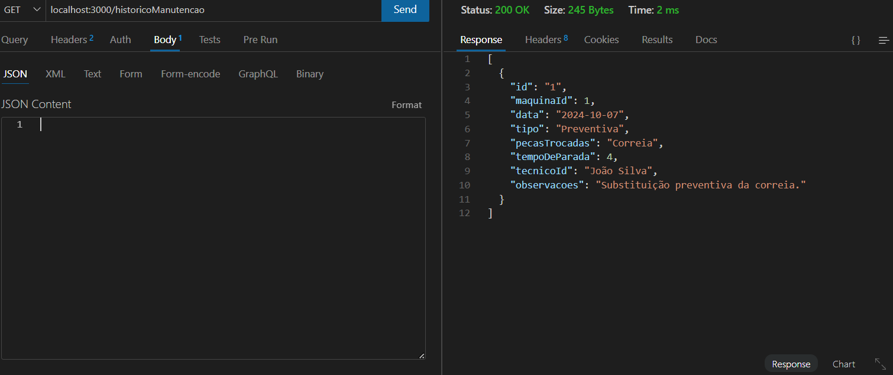
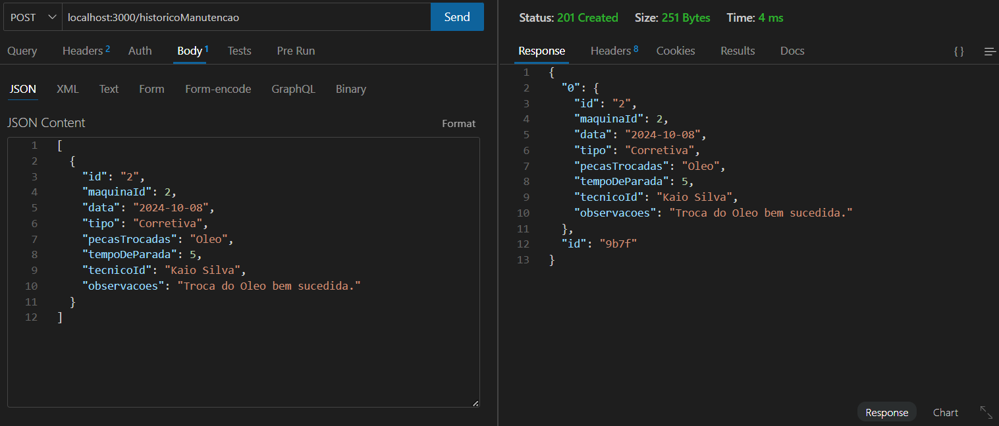

3° Falhas 
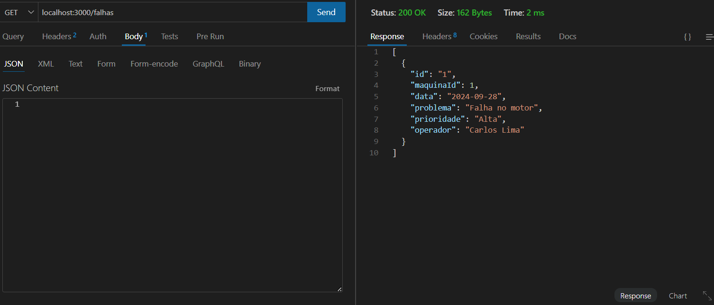
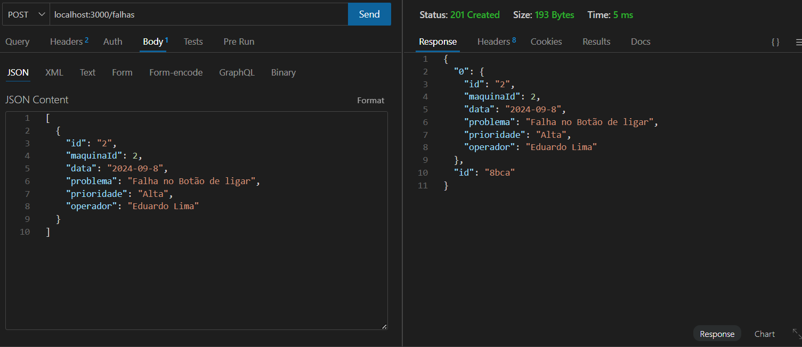

4° Técnicos
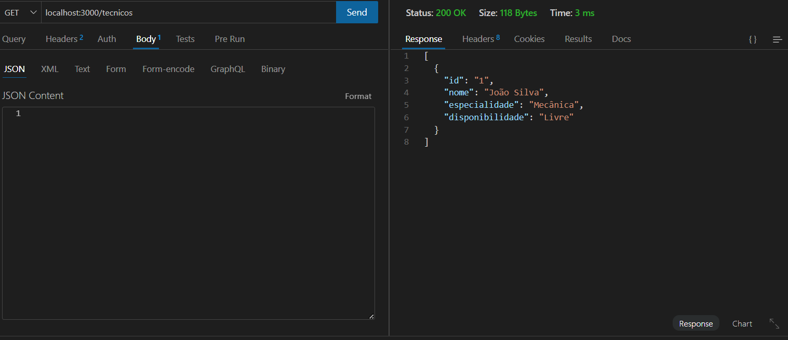
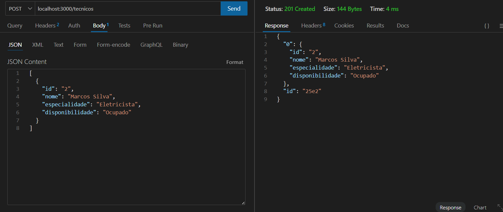
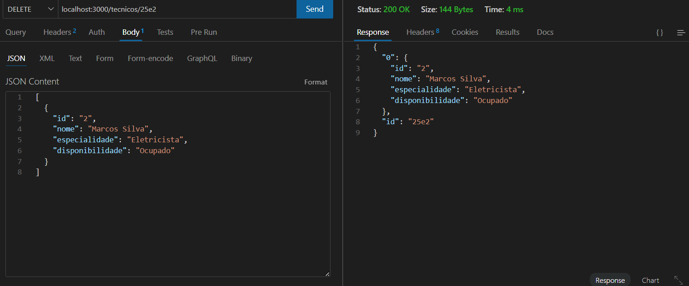

