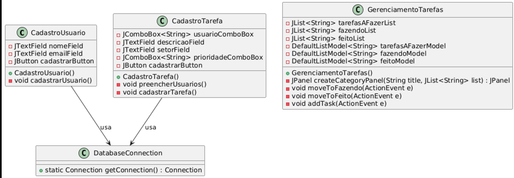
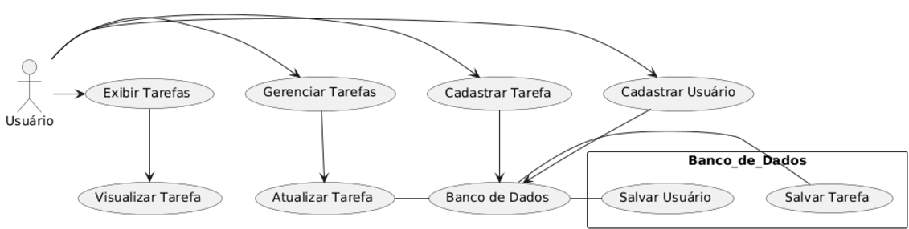
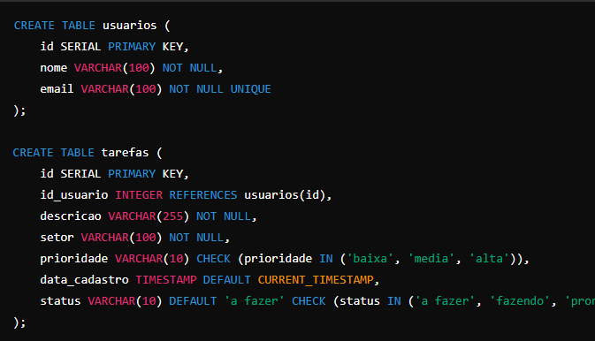

Documentação do Sistema de Gerenciamento de Tarefas
Este sistema é uma aplicação Java para gerenciar tarefas, permitindo o cadastro de usuários e tarefas, além do acompanhamento do status de cada tarefa. Ele utiliza a biblioteca Swing para interface gráfica e JDBC para conexão com um banco de dados PostgreSQL.

Estrutura dos Arquivos
AppMain: Classe principal que define o menu da aplicação e inicializa as telas de cadastro e gerenciamento.
CadastroUsuario: Tela para cadastrar novos usuários no sistema.
CadastroTarefa: Tela para cadastrar novas tarefas associadas a um usuário.
GerenciamentoTarefas: Tela para gerenciar tarefas, permitindo o acompanhamento dos status das tarefas em três listas: "A Fazer", "Fazendo" e "Feito".
DatabaseConnection: Classe utilitária para conectar ao banco de dados PostgreSQL.
Detalhes das Classes
1. AppMain
A AppMain é a janela principal do sistema e contém o menu principal. Ela inclui duas seções de menu:

Cadastro: Possui opções para abrir as telas de cadastro de Usuários (CadastroUsuario) e Tarefas (CadastroTarefa).
Gerenciamento: Possui uma opção para abrir a tela de Gerenciamento de Tarefas (GerenciamentoTarefas).
2. CadastroUsuario
Tela para o cadastro de novos usuários. A interface inclui campos para:

Nome: Nome do usuário.
Email: Endereço de e-mail do usuário.
Botão Cadastrar: Salva os dados no banco de dados, validando o email e verificando se todos os campos foram preenchidos.
3. CadastroTarefa
Tela para o cadastro de novas tarefas associadas a usuários. A interface inclui:

Usuário: Um JComboBox que permite selecionar um usuário registrado (carregado do banco de dados).
Descrição: Descrição da tarefa.
Setor: Setor responsável pela tarefa.
Prioridade: Nível de prioridade da tarefa (baixa, media ou alta).
Botão Cadastrar: Insere a nova tarefa no banco de dados após validações de preenchimento.
4. GerenciamentoTarefas
Tela que permite gerenciar o status das tarefas, organizando-as em três categorias:

Tarefas a Fazer: Lista para tarefas que ainda não foram iniciadas.
Fazendo: Lista para tarefas que estão em andamento.
Feito: Lista para tarefas concluídas.
Esta tela possui as funcionalidades:

Mover para Fazendo: Move uma tarefa da lista "A Fazer" para "Fazendo".
Mover para Feito: Move uma tarefa da lista "Fazendo" para "Feito".
Adicionar Tarefa: Permite adicionar uma nova tarefa diretamente na lista "A Fazer".
5. DatabaseConnection
Classe utilitária para estabelecer uma conexão com o banco de dados PostgreSQL. Ela possui o método getConnection(), que utiliza o DriverManager para conectar ao banco com os dados de URL, usuário e senha fornecidos.

Banco de Dados
O sistema se conecta a um banco de dados PostgreSQL, com as seguintes tabelas principais:

usuarios: Armazena informações sobre os usuários, incluindo id, nome, e email.
tarefas: Armazena informações sobre as tarefas, incluindo id_usuario, descricao, setor, e prioridade.
Execução
Para executar o sistema:

Inicie o banco de dados PostgreSQL e configure-o com as tabelas usuarios e tarefas.
Certifique-se de que as credenciais e URL do banco de dados no DatabaseConnection estão corretas.
Compile e execute a classe AppMain para iniciar a aplicação.
Observações
Este é um sistema simples de gerenciamento de tarefas. Futuras melhorias podem incluir a atualização automática de status da tarefa no banco de dados e a adição de outras funcionalidades de gerenciamento.

DIAGRAMA DE CLASSE

DIAGRAMA DE FLUXO CADASTRO

SCRIPT BANCO DE DADOS
